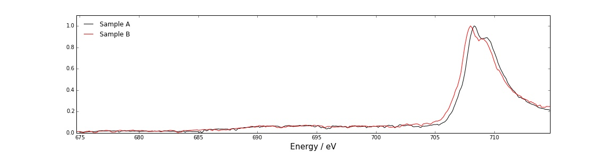
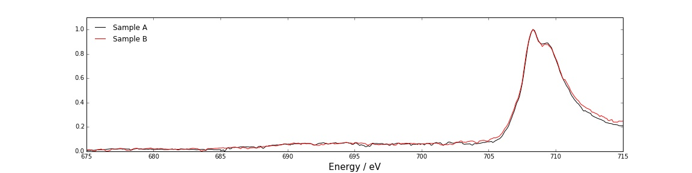
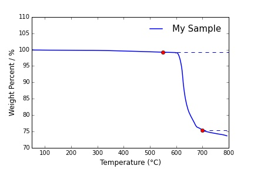
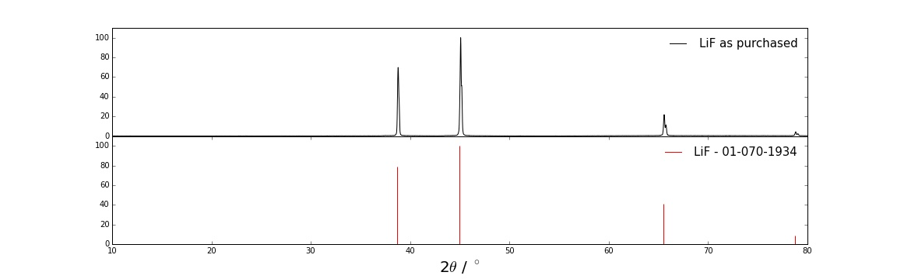
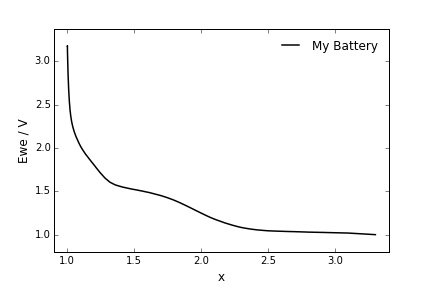

<a href=https://travis-ci.org/michaelplews/materials-research></a>

# Contents
1. [Requirements](#requirements)
2. [X-Ray Absorption Spectroscopy (XAS.py)](#x-ray-absorption-spectroscopy-xaspy)
3. [Thermogravimetric Analysis (TGA.py)](#thermogravimetric-analysis-tgapy)
4. [X-Ray Diffraction (XRD.py)](#x-ray-diffraction-xrdpy)
5. [Electrochemistry (EChem.py)](#electrochemistry-echempy)
6. [Transmission Electron Microscopy (TEM.py)](#transmission-electron-microscopy-tempy)

# Author

The original author of this package can be found at https://github.com/michaelplews/materials-research. I have
downloaded, updated, rearranged, and simplified the installation and usage of this package. Will Eventually make it 
pip installable.

# Installation Requirements

Requirements can be installed with:
```bash

conda create -n cabanalab python=3.6
source activate cabanalab
git clone git@github.com:WilliamJudge94/materials_research.git
pip3 install -r materials_research/requirements.txt
pip3 install ipykernel
ipython kernel install --user --name=cabanalab

```

# Jupyter Commands

Requirements to be used in Jupyter Lab/Notebook - use cabanalab kernel
```python

import sys

# Showing which directory you installed this to
sys.path.append('/path/to/materials_research')

# Example importing of XAS module
from materials_research.cabanalab import XAS as xas

```

# X-Ray Absorption Spectroscopy (XAS.py)

## Use

- The `IDC4` object exports data collected at beamline 4-ID-C at the Advanced Photon Source at Argonne National Laboratory.
- Syntax for use is as follows:
```python
from materials_research.cabanalab import XAS as xas

dire = "./data/4-ID-C/my_data/" #The directory that contains your data
base = "MyData" 				#The base name for all your files (e.g. MyData.0001)

my_sample = xas.IDC4(dire, base, start="1", end="2", shortname = "My Sample")
```
This will load filed 'MyData.0001' and 'MyData.0002' to the IDC4 object and process the data into my_sample.processed_dataframe. 'shortname' defines the legend label for this sample.

To plot data:
```python
fig = plt.figure(1, figsize=(16, 4))

my_sample.plot('STD', color='black')
plt.xlabel(r'Energy / eV', fontsize=15)
```
This plots the 'STD' or Standard data. Other options include 'TEY' (Electron Yield), 'TFY' (Fluorescence Yield), and 'sTFY' (Smoothed Fluorescence Yield).

## Example
### Loading each sample edge into a IDC4 object

```python
dire = "./data/4-ID-C/my_data/"
base = "MyData" 
sample_a = xas.IDC4(dire, base, start="248", end="250", shortname ='Sample A') 
sample_b = xas.IDC4(dire, base, start="244", end="246", shortname = 'Sample B')
```
### Plotting STD data
```python
fig = plt.figure(1, figsize=(16, 4))

sample_a.plot('STD', color='black')
sample_b.plot('STD', color='red')
plt.xlabel(r'Energy / eV', fontsize=15)

show()
```

### Aligning STD data to account for beamdrift

```python
#Find the peak max value between 705 eV and 710 eV and set the x value to 'x_target'
x_target, y = sample_a.max_in_range('STD', low=705, high=710, plot=False, do_return=True)

#Assign the sample_b peak max value to x1 within the same range
x1, y1 = sample_b.max_in_range('STD', low=705, high=710, plot=False, do_return=True)

#Align the sample_b object to sample_a
sample_b.align(x1, x_target)

#Replot STD data
fig = plt.figure(1, figsize=(16, 4))

sample_a.plot('STD', color='black')
sample_b.plot('STD', color='red')
plt.xlabel(r'Energy / eV', fontsize=15)

show()
```


## Supported Importers

| Object        | Beamline      | Facility  |
| ------------- |:-------------:| :-----|
| `IDC4`        | 4-ID-C        | APS, Argonne National Laboratory |
| `ALS6312`     | 6.3.1         | ALS, Lawrence Berkeley National Laboratory |
| `ALS801`      | 8.0.1         | ALS, Lawrence Berkeley National Laboratory |

# Thermogravimetric Analysis (TGA.py)

## Use

- The `TGAFile` object loads data to an object from a .txt file created in Universal Analysis 2000 by TA Instruments.

## Example

```python
from materials_research.cabanalab import TGA as tga

my_sample = tga.TGAFile("../path/to/file.txt", shortname=r'My Sample')

fig = plt.figure(1, figsize=(6, 4))

#plots weight percent on the y axis
my_sample.plot_percent()

#plots a point and hline for a given x value 
my_sample.plot_step(550)
my_sample.plot_step(700)
adjust_axes(50, 800, 70, 110) # a custom function not included in this repo

show()
```


# X-Ray Diffraction (XRD.py)

## Use

- The `BrukerBrmlFile` object imports v4 .brml files taken on a Bruker D8 Advance diffractometer (credit to [m3wolf/scimap project](https://github.com/m3wolf/scimap)). 
- The `XYFile` object imports .xy (ASCII) files taken on the above diffractometer (if .brml file is unavailable)
- `ICDDXmlFile` object imports .xml files exported from 'PDF-2 2013' software to add line patterns for reference materials.
- `MaterProjJSON` object imports the .json files downloaded from [The Materials Project](https://www.materialsproject.org/) to add line patterns for reference materials.

## Example

```python
from materials_research.cabanalab import XRD as xrd

my_sample = xrd.BrukerBrmlFile("./path/to/file.brml", shortname=r'LiF as purchased')
ref_LiF = xrd.ICDDXmlFile("./path/to/file.xml") #defaults to the file name for the legend

fig = plt.figure(1, figsize=(16, 5))

plt.subplot(211)
my_sample.plot(color='black')
hide_x_axis() # a custom function not included in this repo

plt.subplot(212)
ref_LiF.plot('red')

adjust_axes(10,80,0,110)	# a custom function not included in this repo
plt.xlabel(r'2$\theta$ / $^\circ$', fontsize=20)
show()
```


# Electrochemistry (EChem.py)

## Use

- The `MPTFile` and `processedMPTFile` objects exports data collected on Bio-Logic machines. 
- Tested on VMP3, BCS, and SP-50 models.

## Example

```python
from materials_research.cabanalab import EChem as echem

my_battery = echem.MPTFile("./path/to/mptfile", shortname = "My Battery")
my_battery.show_columns #Shows all columns with index numbers in the file
```
Output:
```
00 | mode
01 | ox/red
02 | error
03 | control changes
04 | Ns changes
05 | counter inc.
06 | Ns
07 | time/s
08 | control/V/mA
09 | Ewe/V
10 | dq/mA.h
11 | <I>/mA
12 | P/W
13 | (Q-Qo)/mA.h
14 | x
15 | Capacity/mA.h
```

Plotting the data:
```python
fig = plt.figure(1, figsize=(6, 4))

#Plotting Ewe vs x
my_battery.plot(x=14, y=9, color='black')
plt.xlabel('x', fontsize=12)
plt.ylabel('Ewe / V', fontsize=12)

show()
```


# Transmission Electron Microscopy (TEM.py)

## Requirements

This script is a wrapper for [_dm3_lib.py](https://bitbucket.org/piraynal/pydm3reader/get/b7500989b83a.zip) which should be placed in the same folder as this script. See [documentation for _dm3_lib.py](https://bitbucket.org/piraynal/pydm3reader/) for use. This is included in the `requirements.txt` file.

## Other functions
```python
from materials_research.cabanalab import TEM as tem

myDM3image = tem.DM3File("./path/to/dm3file", shortname = "My Image")
myDM3image.plot()

show()
```

This .plot() function plots a TEM image with axes showing the scale in nanometers. Scale bars are also supported with the scale_bar keyword argument.

# Known Issues

## Error: fromstring has been removed, use frombytes() instead.

This can happen if you have installed an old instance of `_dm3_lib.py`. It is, however, easily fixable. Go to your installation of '_dm3_lib.py', mine was at:
```
/usr/local/lib/python3.5/dist-packages/dm3_lib/_dm3_lib.py
```

Edit the file and change all instances of `fromstring` (mine had 2) to `frombytes`. Restart your python kernel and the issue should be fixed. 
